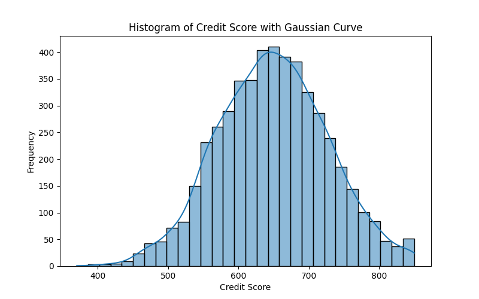
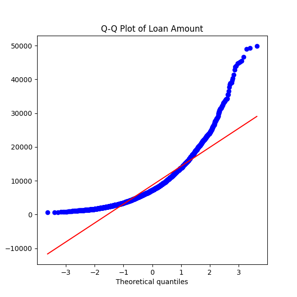

# 📊 Loan Default Risk Analysis using Statistics & Linear Algebra

This project performs **statistical and probability analysis on a loan application dataset** to evaluate customer loan default risk.  
The analysis combines **descriptive statistics, probability theory, data visualization, and linear algebra concepts** using Python.

The goal of this project is to demonstrate how **statistical techniques can help banks understand customer financial behavior and predict potential loan defaults.**

---

# 📁 Dataset

The dataset used in this project contains **5000 loan application records** with the following features:

| Column | Description |
|------|-------------|
| Customer_ID | Unique identifier for each customer |
| Age | Age of the customer |
| Income | Customer's annual income |
| Loan_Amount | Amount of loan taken |
| Credit_Score | Creditworthiness score of the customer |
| Loan_Term_Months | Duration of loan repayment |
| Default_Status | Whether the customer defaulted (Yes/No) |

This dataset is used to perform **statistical analysis and probability modeling for loan default risk.**

---

# 🧮 Concepts Applied

This project applies multiple concepts from **Mathematics, Statistics, and Data Analysis**:

## Descriptive Statistics
- Mean
- Median
- Mode
- Variance
- Standard Deviation

## Probability Theory
- Probability of Loan Default
- Conditional Probability
- Empirical Probability
- Bayes Theorem

## Statistical Distributions
- Histogram analysis
- Gaussian distribution
- Skewness
- Kurtosis
- Q-Q Plot for normality testing

## Linear Algebra
- Vector representation of financial data
- Dot Product
- Vector Norm (L2 Norm)
- Angle between financial vectors

---

# 📊 Visualizations

## Histogram of Credit Score with Gaussian Curve

This plot shows the distribution of credit scores among customers and helps determine whether the data follows a normal distribution.

---

## Q-Q Plot of Loan Amount

The Q-Q plot compares the distribution of loan amounts with a normal distribution to evaluate normality.

---

# 🔢 Probability Analysis

The project calculates:

- **Probability of loan default**
- **Conditional probability of default given low credit score**
- **Contingency tables between credit score ranges and default status**

These analyses help estimate **risk levels for different customer profiles.**

---

# 📐 Linear Algebra Application

Customer financial data can be represented as vectors such as:
v = [Income, Loan_Amount]

Using linear algebra operations we compute:

- **Dot product between customer financial vectors**
- **L2 norm of financial vectors**
- **Angle between vectors to measure similarity**

This helps analyze relationships between different customer financial profiles.

---

# 🛠 Technologies Used

- Python
- NumPy
- Pandas
- Matplotlib
- Seaborn
- SciPy
- Jupyter Notebook

---

# 📂 Project Structure
Loan-Default-Analysis
│
├── loan_applications.csv
├── loan_applications.ipynb
├── Histogram of Credit Score with Gaussian Curve.png
├── Q-Q Plot of Loan Amount.png
└── README.md

---

# 📈 Key Insights

- Customers with **low credit scores have higher probability of default**.
- Loan amount distribution shows **skewness**, indicating variation in loan sizes.
- Credit score distribution is **approximately normal**.
- Higher loan amounts relative to income can indicate **higher financial risk**.

---

# 🎯 Conclusion

This project demonstrates how **statistics, probability, and linear algebra techniques** can be applied to financial datasets to understand customer behavior and assess loan default risk. Such analyses help financial institutions make **data-driven lending decisions**.

---

⭐ If you found this project useful, consider giving it a star!